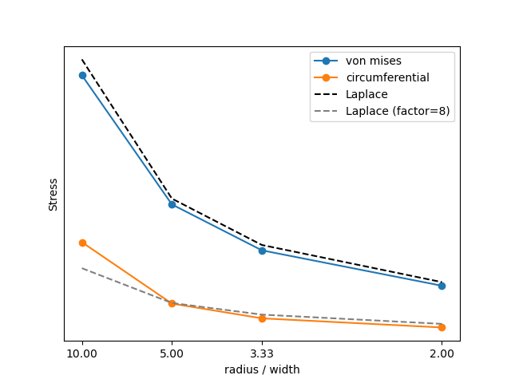
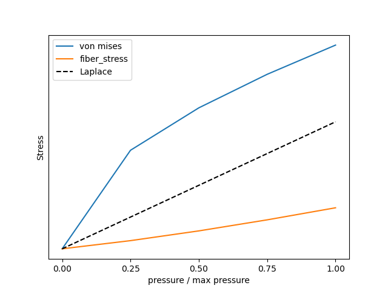

# From the Law of Laplace to FEM-based stress estimation

Henrik Finsberg
Work seminar
November 30th 2023

---

# Goal

How well does the law of Laplace approximate the stresses in the heart (left ventricle)

---

## What is the law of Laplace

The law of laplace states that

$$
\text{ws} = \frac{p \times r}{2 \times w}
$$

---

## We can test this in a finite element model

Here using $r = 1$, $w = 1$ and $p = 0.4$ in which case $\text{ws} = 0.4$

---

# We can also test this law using different radii

By average the stress over the entire geometry

---

# With different widths

---

# Or with different pressures

* But let us try to make our spherical ventricle a bit more realistic

---

## Lets try to add some fibers in our geometry

And let us first make the fibers circumferential
* We will now compute the stress in the direction of the fibers

---

## Stress has nine components

We orient a cube to so that fibers are aligned with one of the axes.

Taken from 10.1186/s12968-016-0258-x under [CC BY 4.0 DD](https://creativecommons.org/licenses/by/4.0/) and from https://en.wikipedia.org/wiki/Cauchy_stress_tensor#/media/File:Components_stress_tensor_cartesian.svg  under [CC BY-SA 3.0 DEED](https://creativecommons.org/licenses/by-sa/3.0/deed.en)

---

---

---

---

## The myocardium is anisotropic

In the calculations so far we have assumed that the heart is linear elastic, isotropic and undergoes small deformation (e.g steel). However, the myocardium is nonlinear, anisotropic and undergoes large deformations.

---

## Using an anisotropic material model

---

## The left ventricle is not a sphere

