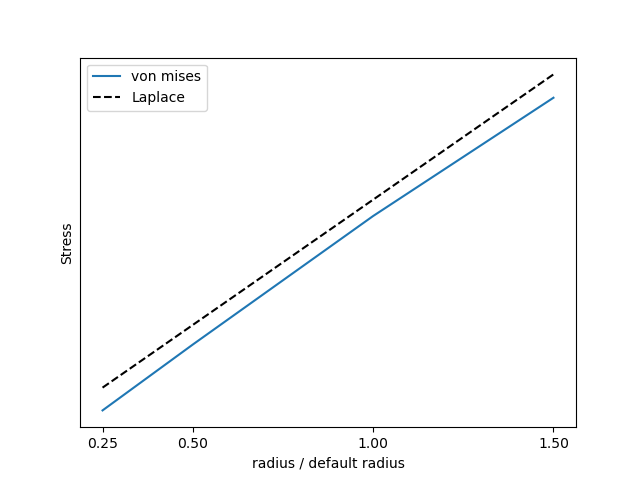
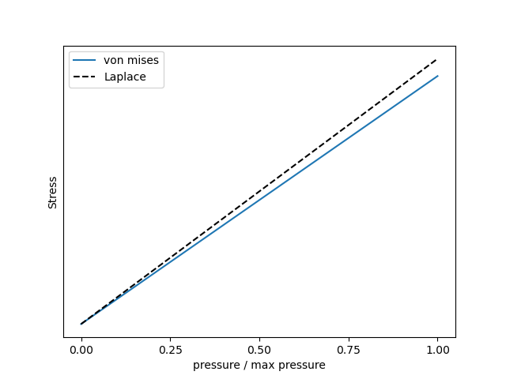
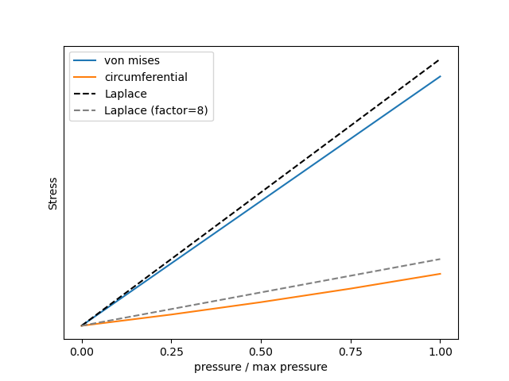
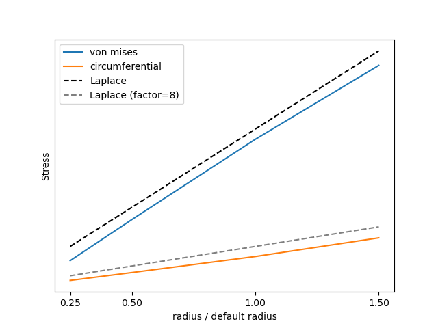
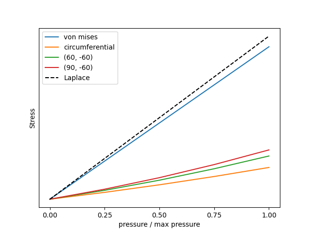
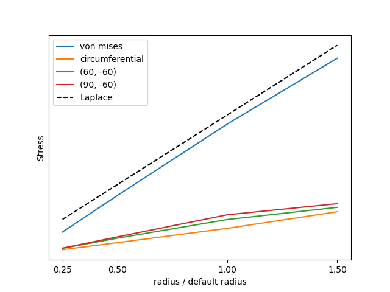
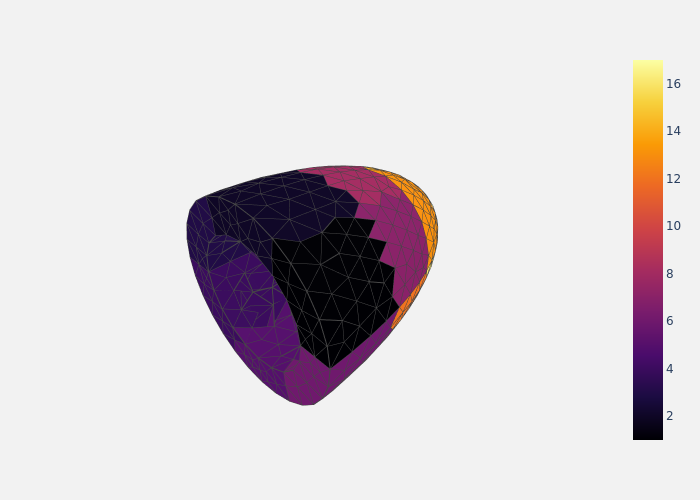
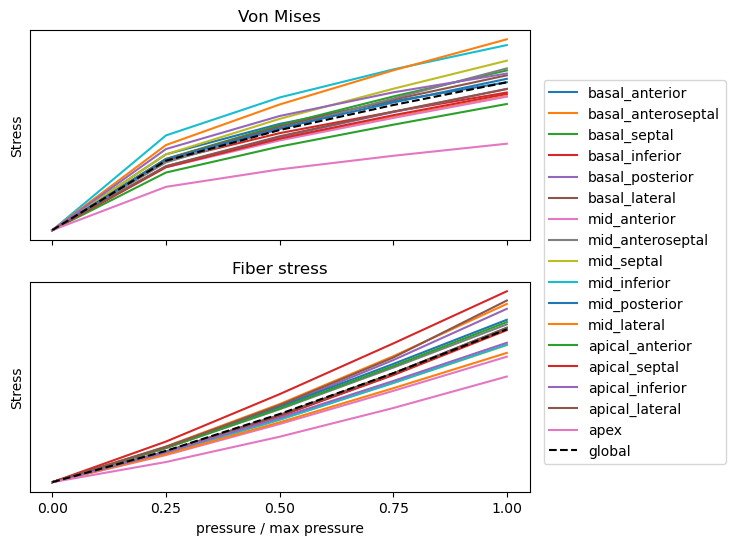
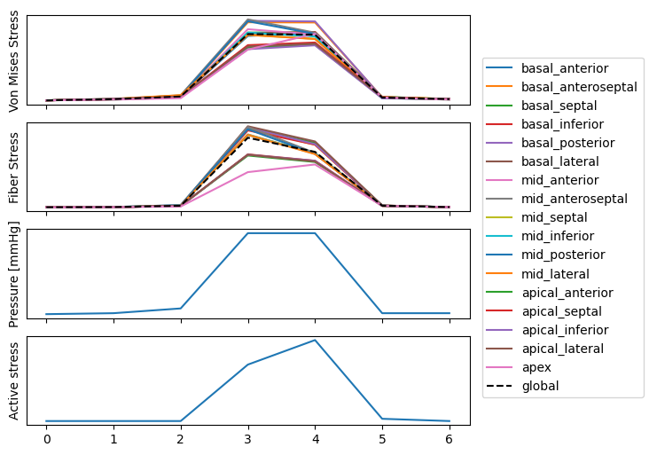

# From the Law of Laplace to FEM-based stress estimation

Cardiac-Work seminar
Rikshopitalet, November 30th 2023

Henrik Finsberg
*Senior Research Engineer*
*Simula Research Laboratory*

---

# Goal

How well does the law of Laplace approximate the stresses in the heart (left ventricle)

* and what can we gain from a using a finite element-based model

---

---

The law of Laplace does not take into account

- regional differences
- anisotropy (myocardium behaves differently in fiber and cross fiber direction)

---

## What is the law of Laplace?

The law of laplace states that

$$
\text{ws} = \frac{p \times r}{2 \times w \left( 1 + \frac{w}{2r}\right)} \approx^{w \ll r} \frac{p \times r}{2 \times w}
$$

Woods, Robert H. "A few applications of a physical theorem to membranes in the human body in a state of tension." Journal of anatomy and physiology 26.Pt 3 (1892): 362.

---

## How can we use the Law of Laplace?

- Hypertension → ↑ pressure → ↑ wall stress

- Concentric hypertrophy → ↑ wall thickness → ↓  wall stress

* So the heart can compensate increased wall stress by thickening the wall
* Increased wall stress  → remodeling  → heart failure

---

## The finite element method (FEM) is a way to solve equations on complex geometries

---

## We can test this in a finite element model

---

We can also test this law using different radii

---

With different widths

---

Or with different pressures

* But let us try to make our spherical ventricle a bit more realistic

---

## Lets try to add some fibers in our geometry

And let us first make the fibers circumferential
* We will now compute the stress in the direction of the fibers

---

## Stress has nine components

We orient a cube to so that fibers are aligned with one of the axes.

Taken from 10.1186/s12968-016-0258-x under [CC BY 4.0 DD](https://creativecommons.org/licenses/by/4.0/) and from https://en.wikipedia.org/wiki/Cauchy_stress_tensor#/media/File:Components_stress_tensor_cartesian.svg  under [CC BY-SA 3.0 DEED](https://creativecommons.org/licenses/by-sa/3.0/deed.en)

---

## Comparing circumferential stress with Laplace

---

---

## Comparing fiber stress with Laplace

---

## The myocardium is nonlinear and anisotropic

In the calculations so far we have assumed that the heart is linear elastic, isotropic and undergoes small deformation (e.g steel). However, the myocardium is nonlinear, anisotropic and undergoes large deformations.

---

## Using an anisotropic material model

---

## The left ventricle is not a sphere

---

We can redo the analysis using ellipsoids with different widths and ratios between the short and long axis

---

We fix the radius along the short axis and vary the width and the long axis radius

---

## Using an anisotropic material model and an ellipsoidal geometry

---

## With FEM-based models we can alo compute the stresses in each AHA segment

---

<!-- ---

## Laplace law does not take into account that the heart is contracting

 -->

---

## In FEM we can fit clinical data to patient specific geometries

<video width="900" autoplay loop muted playsinline>
  <source src="https://github.com/finsberg/stress-fem-vs-simple/raw/main/figures/patient_stress.mp4" type="video/mp4">
Your browser does not support the video tag.
</video>

---

## In summary

* Laplace law is good for intuition about how pressure, wall thickness and radius is related to the wall stress
* But, it does not capture
  - anisotropy
  - regional differences
* Models based on finite element method can be fitted to clinical data which allows for patient-specific stress estimations

* Slides and material
  - Code and material: https://github.com/finsberg/stress-fem-vs-simple
  - Slides: https://finsberg.github.io/stress-fem-vs-simple/

---

## Things we could include (but probably will not have time)

- Patient specific geometry
- Scar tissue (spatially varying stiffness)
- Other?
